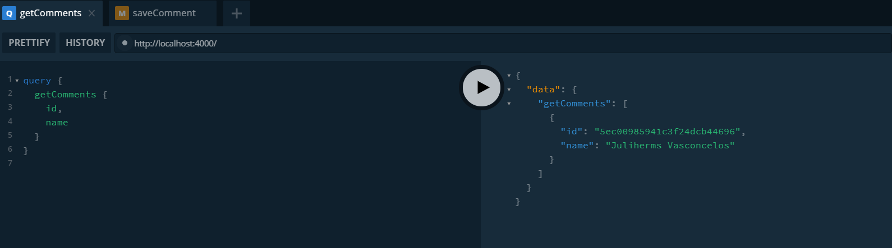
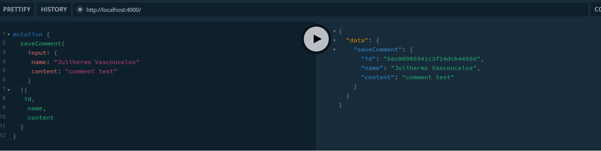
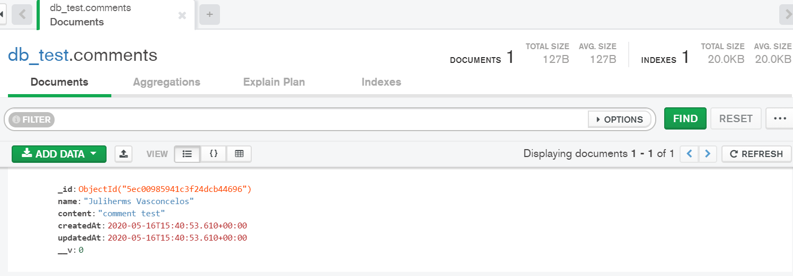

API example with mongo and apollo server


### Requirements

- Mongo Databae ([Mongo](https://www.mongodb.com/cloud) or [Docker Mongo](https://hub.docker.com/_/mongo))
- [Node](https://nodejs.org/en/)
- [Yarn](https://yarnpkg.com/en/docs/install#debian-stable) or Npm (Just install Node)

### Install and run

Do you need a mongo database in our systems

```bash
### Create a mongo image
docker run --name db_mongo -p 27017:27017 -d -t mongo 

```
### For dependency install
```bash
$ yarn
```

### For run application
```bash
$ yarn dev
```

### GraphQL benefits

- Overfeching







